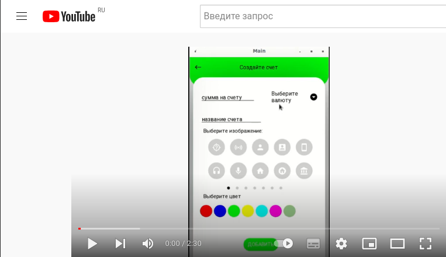
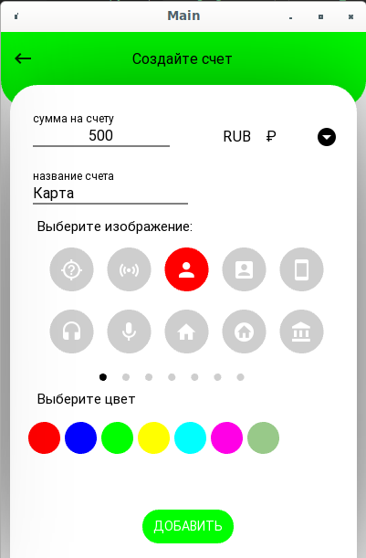
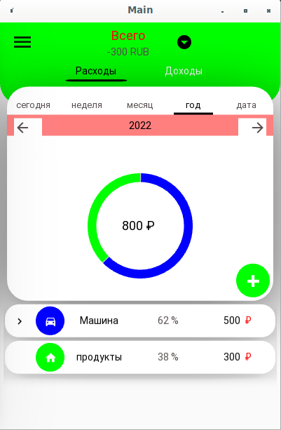
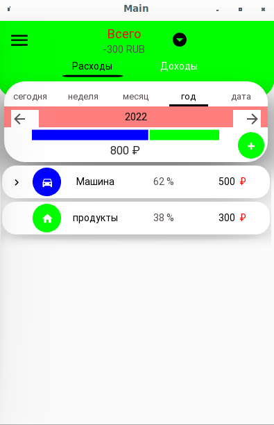
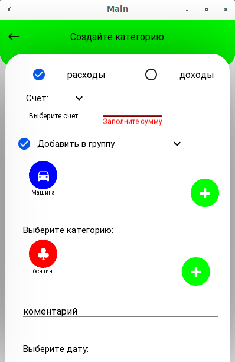

# PersonalFinance  
## Кроссплатформенное приложение на Python, для введения личного бюджета.   

### Стек библиотек:
* pipenv (virtual environment)
* python3
* KivyMD
* SQLAlchemy

Подробности [Pipfile](Pipfile)

### Видео с YouTube :

 
    

## screenshots приложения: 

 
     </img>
    </img>
    </img>
    </img>

### Структура проекта: 
.  
├── data  
│   ├── config.ini  
│   ├── DataBaseInner.db  
│   ├── DataBaseOuter.db  
│   ├── img  
│   │   └── f.png  
│   └── logs  
├── database  
│   ├── manage_inner.py  
│   ├── manage_outer.py  
│   ├── models_inner.py  
│   └── models_outer.py  
├── default.code-workspace  
├── general_box  
│   ├── account_window.py  
│   ├── box_data.py  
│   ├── box_detail.py  
│   ├── box_icon.py  
│   ├── date_choice.py  
│   ├── header.py  
│   ├── kv  
│   │   ├── account_window.kv  
│   │   ├── box_data.kv  
│   │   ├── box_detail.kv  
│   │   ├── box_icon.kv  
│   │   ├── header.kv  
│   │   ├── navigation.kv  
│   │   ├── text_input.kv  
│   │   └── сhoice_сategory.kv  
│   ├── line_progress.py  
│   ├── progress_bar.py  
│   ├── text_input.py  
│   └── сhoice_сategory.py  
├── main.py  
├── Pipfile  
├── Pipfile.lock  
├── README.md  
├── screen  
│   ├── add_account_credit  
│   │   ├── add_account_screen.py  
│   │   ├── box_icon.py  
│   │   └── kv  
│   │       ├── add_account_screen.kv  
│   │       └── box_icon.kv  
│   ├── add_article  
│   │   ├── add_article_screen.py  
│   │   ├── box_icon.py  
│   │   └── kv  
│   │       ├── add_article_screen.kv  
│   │       └── box_icon.kv  
│   ├── add_icon  
│   │   ├── add_icon_screen.py  
│   │   └── kv  
│   │       └── add_icon_screen.kv  
│   ├── add_transfer  
│   │   ├── add_transfer_screen.py  
│   │   └── kv  
│   │       └── add_transfer_screen.kv  
│   ├── all_account  
│   │   ├── all_account_screen.py  
│   │   └── kv  
│   │       └── all_account_screen.kv  
│   ├── detail_article  
│   │   ├── detail_article_screen.py  
│   │   └── kv  
│   │       └── detail_article.kv  
│   ├── icon_all  
│   │   ├── box_icon.py  
│   │   ├── icon_all_screen.py  
│   │   └── kv  
│   │       ├── box_icon.kv  
│   │       └── icon_all_screen.kv  
│   ├── main_screen  
│   │   ├── box_detail.py  
│   │   ├── kv  
│   │   │   ├── box_detail.kv  
│   │   │   └── main_screen.kv  
│   │   └── main_screen.py  
│   └── navigation_bar  
│       ├── kv  
│       │   └── navigation_bar.kv  
│       └── navigation_bar.py  
├── screenshots  
│   ├── 01_init_account.png  
│   ├── add_article_screen.png  
│   ├── finance.mp4  
│   ├── main_screen_2.png  
│   ├── main_screen.png  
│   └── YouTube.png  
├── settings.py  
├── tests  
│   ├── conftest.py  
│   └── database  
│       ├── conftest.py  
│       └── test_manage_outer.py  
└── utils  
    ├── dispatcher.py  
    ├── re_text.py  
    └── thread_popup.py  
  
29 directories, 70 files  

В настоящее время проект еще не законченн.
